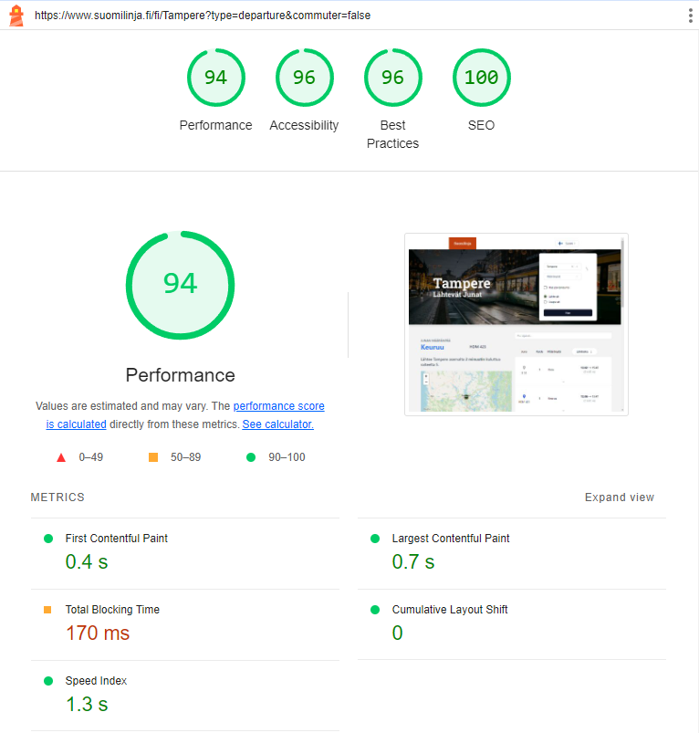

## Introduction

Suomilinja is a mobile-friendly website for tracking real-time Fintraffic data, built on React and Next.js.

### Tools used

- Next.js
- React.js
- Tailwind CSS
- TypeScript
- Shadcn/Radix
- Leaflet

## How to use

1. Visit the website [Suomilinja.fi](https://www.suomilinja.fi/fi)
2. Pick a station of your choice by either filling in the form or picking one of the suggestions 

## Features

### Leaflet Map View

Suomilinja uses the lightweight, open-source JavaScript library [Leaflet](https://leafletjs.com/) for an interactive map experience. With the use of React's state management, the website is able to display accurate train geolocations in real time.

### Performance

With the use of React's Server Components and optimizations like serving images in next-gen formats (webp), the website loads quickly for end-users, even with client side features such as the interactive map view. Fast load times are essential when end-users are travelling on a train, when internet speeds might fall short of what you'd expect from a populated area.



### Unit Testing

The website is built with Unit Tests, to ensure subsequent updates do not break existing features. Below is an example of a unit test for NavigationComponent:

```javascript
it('renders the swap button and expects it to be disabled by default', () => {
    render(
        <NextIntlClientProvider
            locale="en"
            messages={pick(messages, ['TimeTable', 'Navigation'])}
        >
            <NavigationComponent {...mockProps} />
        </NextIntlClientProvider>
    );
    const swapButton = screen.getByTestId('swap-stations-button');
    expect(swapButton).toBeInTheDocument();
    expect(swapButton).toBeDisabled();
});